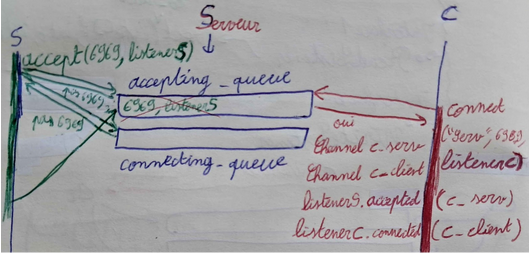
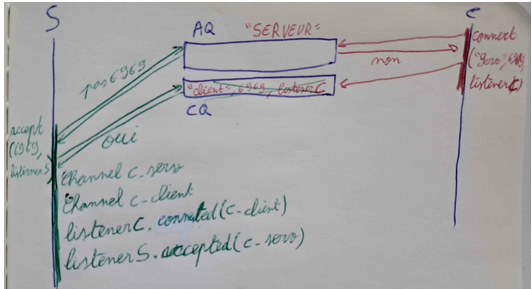
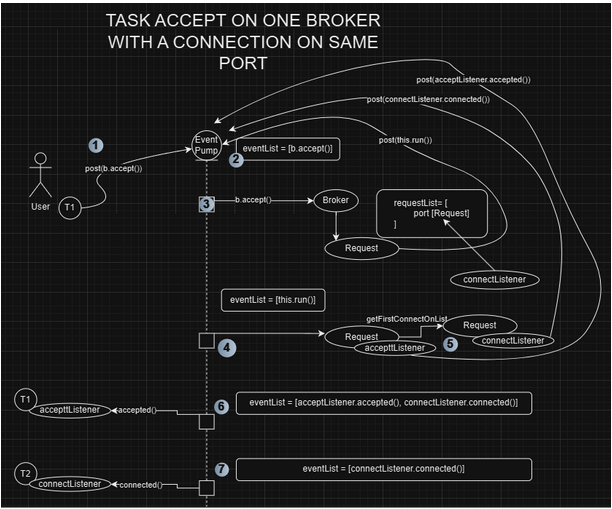
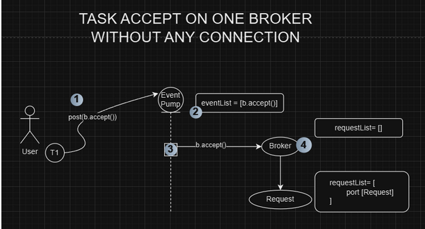
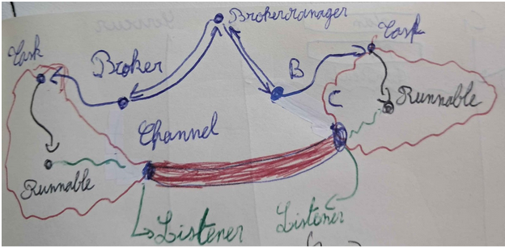

[back to root README.md](../README.md)
# Design

#### **Eventful Rendez-vous**:

The main challenge involves handling connection events seamlessly without blocking other processes. This design uses an event-driven approach to prevent bottlenecks during connection setup and communication between tasks.  
To ensure connection, each broker will get 2 lists: an accepting queue (<port, ConnectedListener>) and a connecting queue (<port, name, ConnectedListener>).  
The **acceptingqueue** will get the accepting ports of the local broker when it uses the accept*()* method.  
The **connectingqueue** will be filled by remote brokers which do *connect()* on the local broker.  
In the next, we will call **lb** the local broker and **rb** the remote and we always speak about local broker’s accepting and connecting queues.  
However, we have to consider 2 cases:

* Accept before connect:  
  - lb does accept on a port p  
  - p is not on its accepting queue  
  - p is not on its connecting queue  
  - lb put into its accepting queue a new entry with its accepting port p and the listener associated

  - rb does connect on p with lb  
  - rb checks and finds p into lb’s accepting queue  
  - rb creates so local and remote channels  
  - rb callbacks the listener in accepting queue of lb  
  - rb deletes the entry associated to p  
  - rb callbacks itself’s listener

  
  

* Connect before accept:  
  - rb does connect on a port p with lb  
  - p is not in accepting queue  
  - rb put into connecting queue a new entry (“at the end” of queue) with its connecting port p, its name and the listener associated

  - lb does accept on p  
  - its accepting queue doesn’t contain p  
  - lb checks and finds p into its connecting queue (by browsing queue from index 0)  
  - lb creates so local and remote channels  
  - lb callbacks the listener in connecting queue of rb  
  - lb deletes the entry associated to p and name  
  - lb callbacks itself’s listener

  

#### **BrokerManager**:

To allow our application to know which broker is created, we use a brokermanager that saves all the brokers created. Thus, when a broker tries to connect to another broker, the connect method will call the brokermanager thanks to its name to get the broker to connect to.

#### **Tasks**:

Each client will use a task to manage its connection. This task will post the events to the event pump.

#### **Threads**

Because of the event-driven approach, we use only one thread for the event pump.
Tests will use another thread.

## Classes diagram

Here is the classes diagram of this system:  
