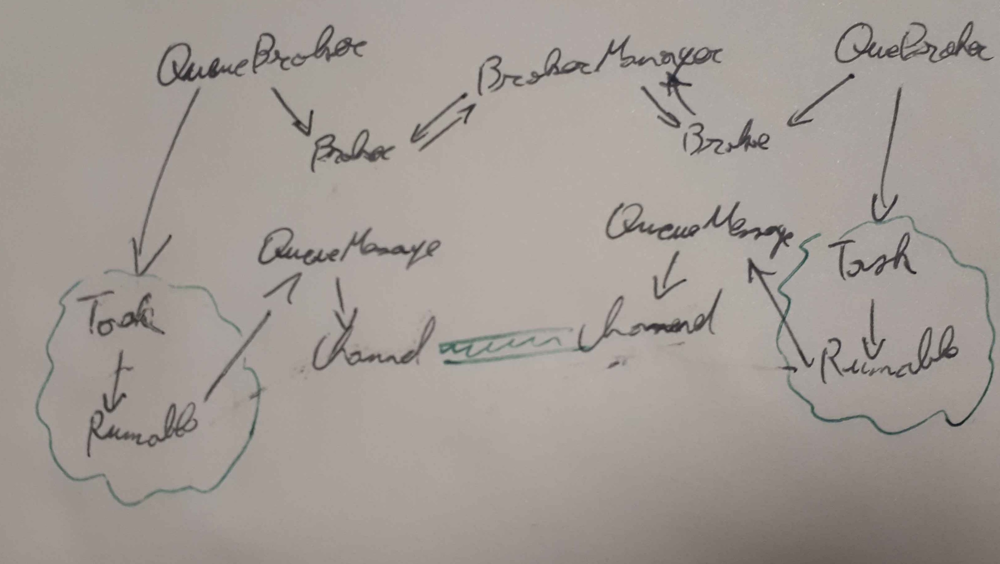
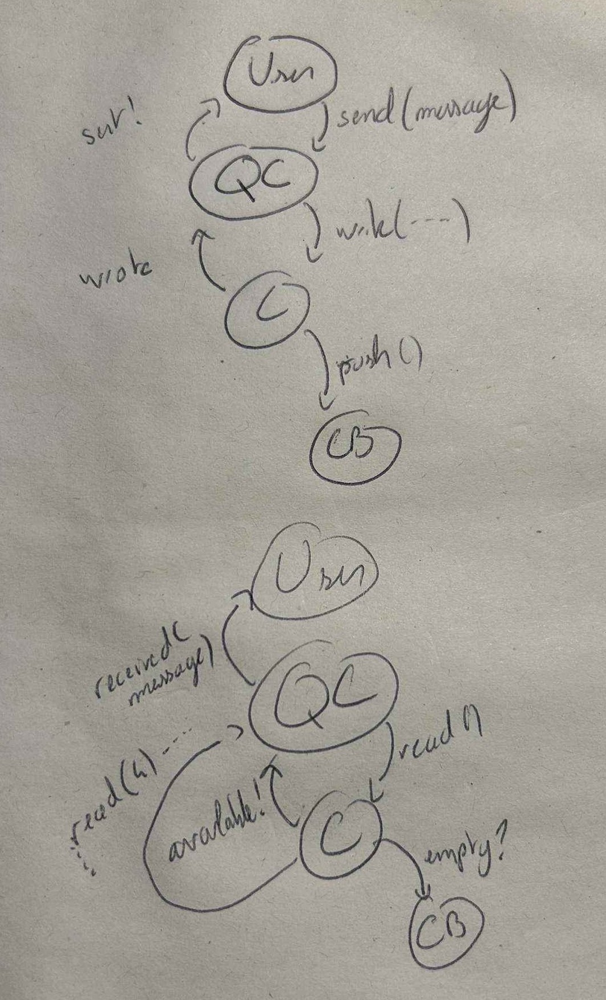

[back to root README.md](../README.md)
# Design : QueueBroker and MessageQueue full-event

## Principle : 

This time, there is only one thread running. Everything is in the “Event world”, so there is no blocking method. The EventPump manages all tasks. 

## Main class diagram

## EventPump : 

The  *EventPump* runs on only ONE THREAD.The *EventPump* will run all events in his list with the method *run()*. The method *post()* of a task will call the method *post()* of the *EventPump* which will add an event to the *EventPump.*

## General class diagram for read and write :

 

### Read :

1. The channel regularly tries to see if it can be read.  
2. When it can, it returns an available event to the MessageQueue layer.  
3. The MessageQueue calls Channel read.  
4. The channel then returns the read event, giving the bytes read.  
5. The MessageQueue follows the progress of the read with an automaton, first reading the size, then the message.  
6. When the entire message has been read, a recieved event is sent to the user.  
7. The user receives the message lut.  
   

### Write : 

Same principle